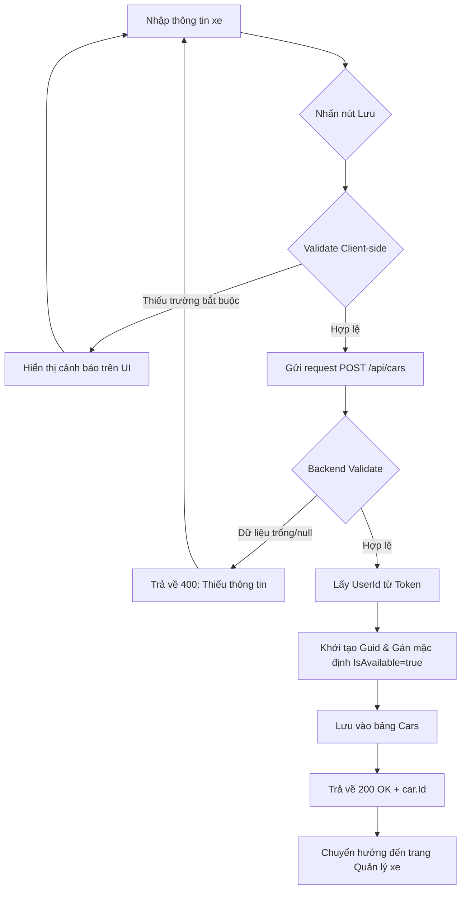
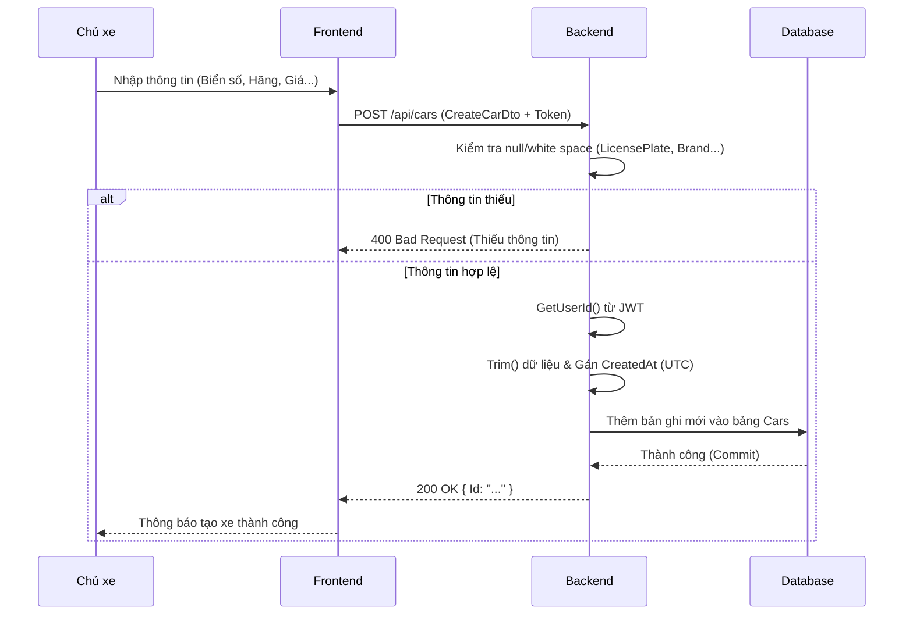

# Software Requirement Specification (SRS)
## Chức năng: Đăng ký xe mới (Create Car)
**Mã chức năng:** CAR-04  
**Trạng thái:** Draft / Review  
**Người soạn thảo:** [Vu Truong Giang]  
**Vai trò:** Developer / Analyst  

---

### 1. Mô tả tổng quan (Description)
Chức năng này cho phép người dùng (Chủ xe) đăng ký thông tin xe mới lên hệ thống để cho thuê. Hệ thống sẽ lưu trữ các thông số kỹ thuật, đặc điểm nhận dạng và giá thuê của xe. Mọi xe sau khi tạo thành công sẽ mặc định ở trạng thái "Sẵn sàng" (`IsAvailable = true`).

---

### 2. Luồng nghiệp vụ (User Workflow)

| Bước | Hành động người dùng | Phản hồi hệ thống |
| :--- | :--- | :--- |
| 1 | Truy cập form "Đăng ký cho thuê xe" | Hiển thị form nhập liệu thông tin xe |
| 2 | Nhập thông tin xe và nhấn "Lưu" | Kiểm tra các trường bắt buộc (Biển số, Hãng, Dòng xe, Địa chỉ) |
| 3 | Gửi request POST đến API | Backend xác thực Token và kiểm tra tính hợp lệ của dữ liệu |
| 4 | Dữ liệu hợp lệ | Khởi tạo Object Car, gán `OwnerId`, băm nhỏ dữ liệu và lưu vào DB |
| 5 | Tạo thành công | Trả về `Id` của xe mới và thông báo thành công |
| 6 | Thiếu thông tin | Trả về lỗi 400 kèm thông báo thiếu thông tin bắt buộc |

---

## 🔄 Create Car Flow (Mermaid Diagram)

---

### 3. Yêu cầu dữ liệu (Data Requirements)

#### 3.1. Dữ liệu đầu vào (CreateCarDto)
- **LicensePlate:** `string`, bắt buộc, biển số xe (ví dụ: 30A-123.45).
- **Brand:** `string`, bắt buộc, hãng sản xuất (Toyota, VinFast, Hyundai...).
- **Model:** `string`, bắt buộc, dòng xe (Vios, VF8, Accent...).
- **Year:** `int`, năm sản xuất của xe.
- **Seats:** `int`, số chỗ ngồi (4, 5, 7...).
- **Transmission:** `string`, loại hộp số (Số sàn/Số tự động).
- **Fuel:** `string`, loại nhiên liệu (Xăng/Dầu/Điện).
- **Address:** `string`, bắt buộc, địa điểm nhận xe thực tế.
- **PricePerDay:** `decimal/double`, đơn giá thuê cho 1 ngày.
- **Description:** `string`, mô tả chi tiết thêm về xe (không bắt buộc).

#### 3.2. Dữ liệu xử lý (Logic Backend)
- **Validation:** Hệ thống kiểm tra nghiêm ngặt `LicensePlate`, `Brand`, `Model`, `Address`. Nếu bất kỳ trường nào rỗng hoặc chỉ chứa khoảng trắng, hệ thống sẽ từ chối xử lý.
- **Data Cleaning:** Tự động thực hiện hàm `.Trim()` để loại bỏ khoảng trắng thừa ở hai đầu chuỗi văn bản trước khi lưu vào Database.
- **Default Values (Giá trị mặc định):**
    - `Id`: Được khởi tạo bằng `Guid.NewGuid()`.
    - `OwnerId`: Lấy trực tiếp từ Claim của JWT Token (người dùng đang đăng nhập).
    - `IsAvailable`: Luôn mặc định là `true` để xe có thể hiển thị trên thị trường ngay lập tức.
    - `CreatedAt`: Thời gian tạo bản ghi tính theo giờ quốc tế `DateTime.UtcNow`.

#### 3.3. Dữ liệu đầu ra (Response)
- **Success:** Trả về mã `200 OK` kèm theo `Id` (Guid) của xe vừa tạo.
- **Mục đích:** Frontend sử dụng `Id` này để điều hướng người dùng sang trang tải lên hình ảnh xe (Step 2).

---

### 4. Ràng buộc kỹ thuật & Bảo mật (Technical Constraints)

- **Xác thực:** Mọi yêu cầu phải gửi kèm `Authorization: Bearer [JWT]` hợp lệ.
- **Bảo mật danh tính:** `OwnerId` tuyệt đối không được nhận từ phía Client gửi lên. Backend phải tự trích xuất từ Token để đảm bảo tính chính chủ, tránh việc tạo xe thay cho người khác.
- **Toàn vẹn dữ liệu:** Sử dụng cơ chế Transaction (Giao dịch). Nếu việc lưu thông tin xe gặp lỗi, toàn bộ tiến trình phải được hủy bỏ (Rollback) để đảm bảo không có dữ liệu rác trong hệ thống.

---

### 5. Trường hợp ngoại lệ & Xử lý lỗi (Edge Cases)

- **Thiếu thông tin bắt buộc:** Backend trả về lỗi `400 Bad Request` kèm thông báo: "Thiếu thông tin bắt buộc."
- **Sai định dạng dữ liệu:** Nếu các trường số (Year, Seats, Price) nhận giá trị là văn bản không hợp lệ, hệ thống sẽ trả về lỗi định dạng dữ liệu.
- **Lỗi kết nối:** Nếu Database bị ngắt kết nối, hệ thống trả về mã `500 Internal Server Error` và yêu cầu người dùng thử lại sau.

---

### 6. Giao diện (UI/UX)

- **Cấu trúc Form:** Chia thành các nhóm logic (Thông tin chung, Thông số kỹ thuật, Giá & Địa chỉ) để người dùng dễ nhập liệu.
- **Input Controls:**
    - Sử dụng **Dropdown/Select** cho các trường cố định như Hộp số, Nhiên liệu để chuẩn hóa dữ liệu.
    - Sử dụng **Numeric Input** cho các trường liên quan đến giá và số chỗ.
- **Phản hồi người dùng:** Nút "Lưu" phải hiển thị trạng thái **Loading/Disabled** trong khi API đang xử lý để tránh người dùng nhấn lặp lại.
- **Navigation:** Sau khi lưu thành công, hiển thị thông báo "Đăng ký xe thành công" và tự động điều hướng sang phần upload ảnh.

---

### 7. Điều kiện tiền đề & Hậu điều kiện

- **Tiền đề (Pre-conditions):**
    - Người dùng đã đăng nhập với vai trò hợp lệ (Owner).
    - Phiên làm việc (Token) vẫn còn hiệu lực.
- **Hậu điều kiện (Post-conditions):**
    - Một bản ghi xe mới được tạo thành công trong Database.
    - Thông tin xe xuất hiện trong danh sách "Xe của tôi" của người dùng.
