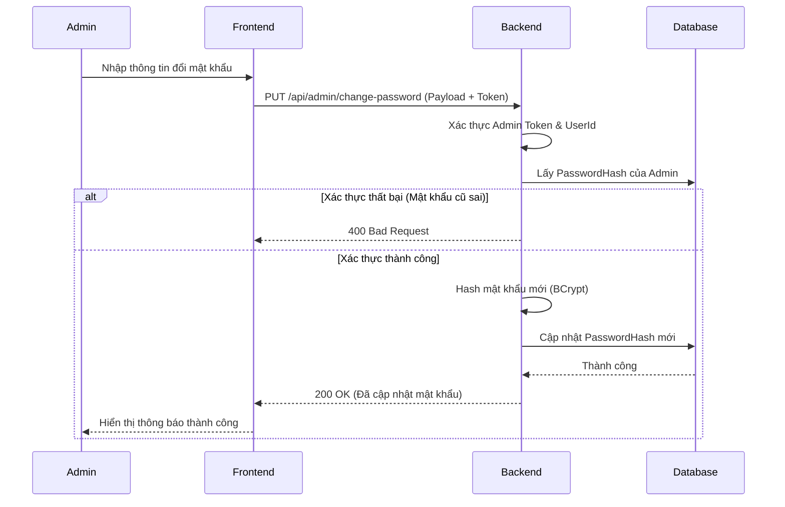

# Software Requirement Specification (SRS)

## Chức năng: Quản lý tài khoản Admin

**Mã chức năng:** ADMIN-01  
**Trạng thái:** Draft / Review  
**Người soạn thảo:** [Gemini Code Assist]  
**Vai trò:** Developer / Analyst

---

### 1. Mô tả tổng quan (Description)

Chức năng này cho phép Quản trị viên (Admin) quản lý thông tin tài khoản cá nhân của mình, cụ thể hiện tại tập trung vào việc thay đổi mật khẩu để đảm bảo tính bảo mật cho quyền quản trị cao nhất. Hệ thống yêu cầu xác thực mật khẩu cũ và thiết lập mật khẩu mới theo các tiêu chuẩn bảo mật của hệ thống.

---

### 2. Luồng nghiệp vụ (User Workflow)

| Bước | Hành động của Admin                                     | Phản hồi hệ thống                                              |
| :--- | :------------------------------------------------------ | :------------------------------------------------------------- |
| 1    | Truy cập trang "Quản lý tài khoản Admin"                | Hiển thị giao diện thay đổi mật khẩu                           |
| 2    | Nhập mật khẩu cũ, mật khẩu mới và xác nhận mật khẩu mới | Kiểm tra tính hợp lệ sơ bộ (Format, độ dài)                    |
| 3    | Nhấn nút "Lưu thay đổi"                                 | Gửi request PUT đến API hệ thống kèm JWT Token                 |
| 4    | Backend xử lý yêu cầu                                   | Xác thực mật khẩu cũ và cập nhật mật khẩu mới vào Database     |
| 5    | Thành công                                              | Trả về thông báo cập nhật thành công                           |
| 6    | Thất bại                                                | Hiển thị lỗi tương ứng (Mật khẩu cũ không đúng, không khớp...) |

---

### 3. Sơ đồ trình tự (Sequence Diagram)



---

### 4. Yêu cầu dữ liệu (Data Requirements)

#### 4.1. Dữ liệu đầu vào

- `OldPassword`: Mật khẩu hiện tại để xác minh quyền sở hữu.
- `NewPassword`: Mật khẩu mới đáp ứng tiêu chuẩn an toàn.
- `ConfirmNewPassword`: Phải trùng khớp hoàn toàn với `NewPassword`.

#### 4.2. Logic xử lý Backend

- **Phân quyền:** Chỉ người dùng có Role `Admin` mới được phép thao tác.
- **Kiểm tra mật khẩu:** Sử dụng `BCrypt.Verify` để so sánh `OldPassword` với mã băm trong Database.
- **Ràng buộc bảo mật:**
  - Mật khẩu mới không được trùng với mật khẩu cũ.
  - Độ dài tối thiểu 8 ký tự, bao gồm chữ hoa, chữ thường, số và ký tự đặc biệt.
- **Lưu trữ:** Mật khẩu mới phải được băm (hash) trước khi lưu để đảm bảo an toàn dữ liệu.

#### 4.3. Dữ liệu đầu ra (Response)

- **Thành công:** Trả về mã 200 OK và thông báo xác nhận.
- **Thất bại:** Trả về lỗi 400 hoặc 401 kèm mô tả lý do cụ thể.

---

### 5. Ràng buộc kỹ thuật & Bảo mật

- **Xác thực:** API được bảo vệ bởi middleware `[Authorize(Roles = "Admin")]`.
- **An toàn dữ liệu:** Mật khẩu truyền đi từ Frontend phải được bảo vệ qua giao thức HTTPS.
- **Idempotency:** Nếu người dùng nhấn nút lưu nhiều lần, hệ thống chỉ xử lý yêu cầu đầu tiên thành công.

---

### 6. Trường hợp ngoại lệ (Edge Cases)

| Tình huống              | Cách xử lý                                             |
| :---------------------- | :----------------------------------------------------- |
| Nhập mật khẩu cũ sai    | Trả về thông báo: "Mật khẩu hiện tại không chính xác". |
| Mật khẩu mới không khớp | Frontend cảnh báo ngay lập tức trước khi gửi request.  |
| Phiên đăng nhập hết hạn | Yêu cầu Admin đăng nhập lại để tiếp tục thao tác.      |

---

### 7. Giao diện tích hợp (UI/UX)

- **Vị trí:** Tích hợp trong trang cá nhân hoặc Dashboard dành riêng cho Admin.
- **Phản hồi:** Hiển thị thông báo (Toast/Alert) rõ ràng sau khi thao tác.
- **Input:** Sử dụng các trường nhập liệu có nút ẩn/hiện mật khẩu để hỗ trợ người dùng.

---

### 8. Điều kiện tiền đề & Hậu điều kiện

- **Tiền đề:** Admin đã đăng nhập thành công vào hệ thống quản trị.
- **Hậu điều kiện:**
  - `PasswordHash` của Admin trong bảng `AppUsers` được cập nhật.
  - Admin có thể sử dụng mật khẩu mới cho lần đăng nhập tiếp theo.

```


```
