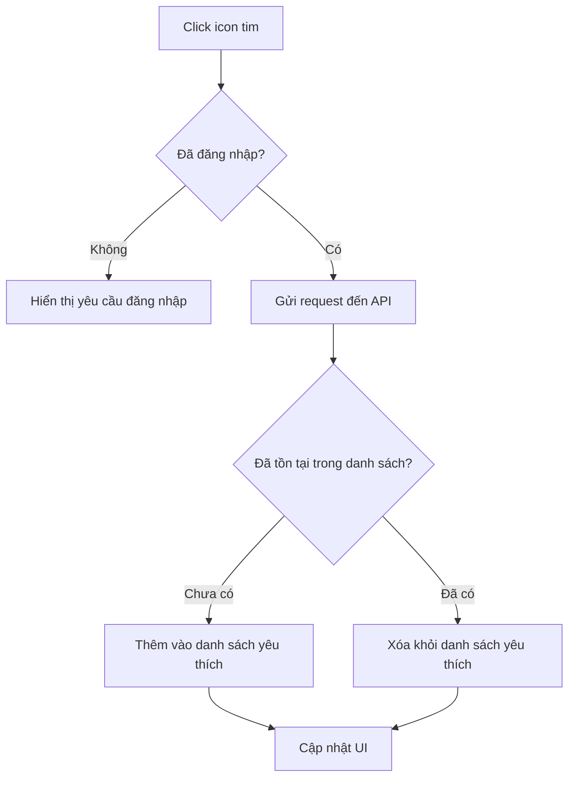
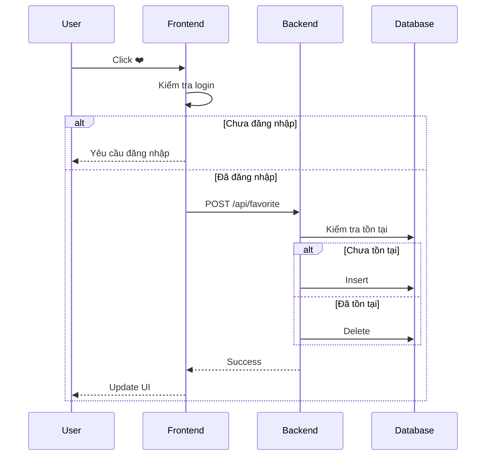

# Software Requirement Specification (SRS)

## Chức năng: Xe yêu thích (Favorite Cars)

**Mã chức năng:** FAVORITE-01  
**Trạng thái:** Draft / Review  
**Người soạn thảo:** Nguyễn Văn Công  
**Vai trò:** Developer / Analyst  

---

## 1. 📌 Mô tả tổng quan (Description)

Chức năng xe yêu thích cho phép người dùng:

- Thêm xe vào danh sách yêu thích
- Xóa xe khỏi danh sách yêu thích
- Xem danh sách xe đã yêu thích

⚠️ Yêu cầu người dùng phải đăng nhập trước khi thao tác.

---

## 2. 🔄 Luồng nghiệp vụ (User Workflow)

| Bước | Hành động người dùng | Phản hồi hệ thống |
| :--- | :--- | :--- |
| 1 | Truy cập danh sách xe | Hiển thị icon ❤️ |
| 2 | Nhấn icon ❤️ | Kiểm tra trạng thái đăng nhập |
| 3 | Chưa đăng nhập | Hiển thị yêu cầu đăng nhập |
| 4 | Đã đăng nhập | Gửi request đến API |
| 5 | Backend xử lý | Thêm hoặc xóa favorite |
| 6 | Thành công | Cập nhật UI |

---

## 🔄 Favorite Flow (Mermaid Diagram)

## 🔗 Sequence Diagram

## 3. 📊 Yêu cầu dữ liệu (Data Requirements)

### Input

- userId (từ JWT token)
- carId

---

### Output

- Danh sách xe yêu thích
- Trạng thái thành công / thất bại

---

## 4. 🔌 API Specification

### Thêm / Xóa yêu thích

POST /api/favorite

Body:

{
  "carId": "string"
}

---

### Lấy danh sách yêu thích

GET /api/favorite

---

### Response Codes

- 200 OK  
- 401 Unauthorized  
- 404 Not Found  
- 500 Internal Server Error  

## 5. ⚠️ Edge Cases

- Chưa login → yêu cầu đăng nhập
- Thêm trùng → không thêm
- Xóa khi không tồn tại → bỏ qua
- Lỗi server → thông báo lỗi

---

## 6. 📏 Business Rules

- Mỗi user chỉ favorite 1 xe 1 lần
- Không cho thao tác khi chưa đăng nhập