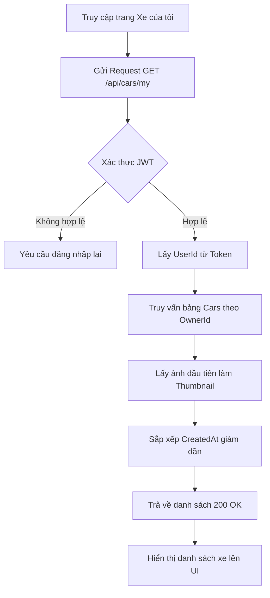
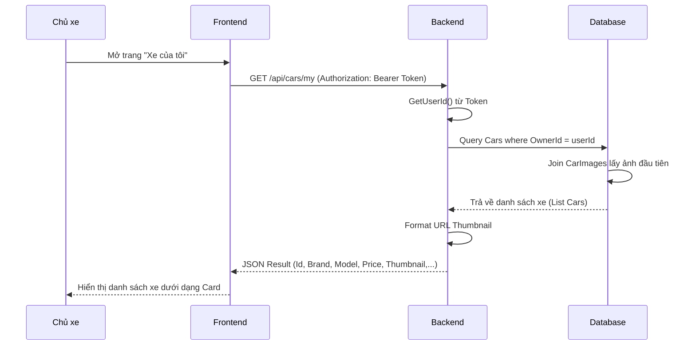

# Software Requirement Specification (SRS)
## Chức năng: Danh sách xe của tôi (My Cars)
**Mã chức năng:** CAR-03  
**Trạng thái:** Draft / Review  
**Người soạn thảo:** [Vu Truong Giang]  
**Vai trò:** Developer / Analyst  

---

### 1. Mô tả tổng quan (Description)
Chức năng này cho phép **Chủ xe (Owner)** xem danh sách tất cả các xe mà họ đã đăng ký lên hệ thống. Hệ thống sẽ hiển thị các thông tin cơ bản của xe kèm theo ảnh đại diện (Thumbnail) để chủ xe dễ dàng theo dõi trạng thái và quản lý tài sản của mình.

---

### 2. Luồng nghiệp vụ (User Workflow)

| Bước | Hành động người dùng | Phản hồi hệ thống |
| :--- | :--- | :--- |
| 1 | Truy cập vào mục "Xe của tôi" | Frontend gửi request kèm JWT Token đến API |
| 2 | Hệ thống xác thực người dùng | Backend lấy `userId` từ Token |
| 3 | Truy vấn dữ liệu | Backend tìm kiếm các xe có `OwnerId` tương ứng trong Database |
| 4 | Xử lý hình ảnh | Hệ thống tự động chọn ảnh loại `Type = 0` (Mặt trước) làm ảnh đại diện |
| 5 | Trả về kết quả | Hiển thị danh sách xe sắp xếp theo thời gian tạo mới nhất |

---

## 🔄 My Cars Flow (Mermaid Diagram)

---

### 3. Yêu cầu dữ liệu (Data Requirements)

#### 3.1. Dữ liệu đầu vào (Request)
- **Header:** `Authorization: Bearer [JWT_Token]` (Bắt buộc để xác thực người dùng).

#### 3.2. Dữ liệu xử lý (Logic Backend)
- **Lọc dữ liệu:** Truy vấn bảng `Cars`, chỉ lấy các bản ghi có `OwnerId` khớp với `userId` được trích xuất từ Token.
- **Sắp xếp:** Sử dụng `OrderByDescending(c => c.CreatedAt)` để hiển thị xe mới nhất lên đầu danh sách.
- **Xử lý Thumbnail:**
    - Hệ thống tìm kiếm trong bảng `CarImages`.
    - Ưu tiên chọn ảnh có `Type = 0` (Mặt trước).
    - Nếu không có `Type = 0`, lấy ảnh đầu tiên dựa trên `SortOrder`.
- **Tối ưu hóa:** Sử dụng `.AsNoTracking()` trong Entity Framework để giảm tải bộ nhớ và tăng tốc độ truy vấn cho các thao tác chỉ đọc (Read-only).

#### 3.3. Dữ liệu đầu ra (Response)
Danh sách trả về một mảng các đối tượng xe, mỗi đối tượng gồm:
- `Id`: `Guid/int`, mã định danh xe.
- `Brand`, `Model`, `Year`: Thông tin chi tiết về hãng, dòng và đời xe.
- `Seats`: Số chỗ ngồi.
- `Address`: Địa điểm hiện tại của xe.
- `PricePerDay`: Giá thuê tính theo ngày.
- `IsAvailable`: Trạng thái (Trống/Đang được thuê).
- `Thumbnail`: Chuỗi URL đầy đủ dẫn đến file ảnh (đã được nối với `baseUrl`).

---

### 4. Ràng buộc kỹ thuật & Bảo mật (Technical Constraints)

- **Xác thực (Authentication):** Chỉ những yêu cầu có đính kèm JWT hợp lệ mới được xử lý.
- **Bảo mật dữ liệu (Data Privacy):** Chủ xe tuyệt đối không thể truy cập danh sách xe của người khác thông qua việc thay đổi ID (Ràng buộc chặt chẽ bởi `userId` lấy từ Token phía Backend).
- **Xử lý hình ảnh:** Nếu xe chưa được cập nhật ảnh, trường `Thumbnail` phải trả về `null` thay vì chuỗi trống hoặc lỗi 404.
- **Tối ưu hóa băng thông:** Chỉ thực hiện `Select` các trường cần thiết cho giao diện danh sách, không tải các dữ liệu nặng như `Description` chi tiết hoặc toàn bộ danh sách ảnh trong bước này.

---

### 5. Trường hợp ngoại lệ & Xử lý lỗi (Edge Cases)

- **Danh sách trống:** Nếu chủ xe chưa đăng ký xe nào, trả về mã `200 OK` với mảng rỗng `[]`. Frontend hiển thị thông báo: "Bạn chưa đăng ký xe nào".
- **Token hết hạn/Sai:** Trả về mã lỗi `401 Unauthorized`. Frontend điều hướng về trang đăng nhập.
- **Lỗi đường dẫn ảnh:** Nếu ảnh không tồn tại trên server, trả về `null` để Frontend hiển thị ảnh mặc định (Placeholder).

---

### 6. Giao diện (UI/UX)

- **Layout:** Hiển thị dưới dạng danh sách các thẻ (**Card**) trực quan.
- **Thông tin trên Card:**
    - Ảnh đại diện xe (Thumbnail).
    - Tên xe (Kết hợp Brand + Model).
    - Giá thuê và địa chỉ.
    - Nhãn trạng thái (Badge): **Available** (Xanh) hoặc **Busy** (Đỏ).
- **Tương tác:**
    - Nhấn vào Card để xem chi tiết xe.
    - Tích hợp nút "Chỉnh sửa" hoặc "Quản lý" nhanh trên từng thẻ.
- **Tính năng bổ sung:** Hỗ trợ **Pull-to-refresh** trên thiết bị di động để người dùng cập nhật lại danh sách.

---

### 7. Điều kiện tiền đề & Hậu điều kiện

- **Điều kiện tiền đề (Pre-conditions):**
    - Người dùng đã đăng nhập thành công.
    - Tài khoản có quyền hợp lệ (Owner/Customer).
- **Điều kiện hậu (Post-conditions):**
    - Hiển thị danh sách xe thuộc sở hữu của người dùng một cách chính xác.
    - Trạng thái xe được cập nhật thời gian thực từ Database.
