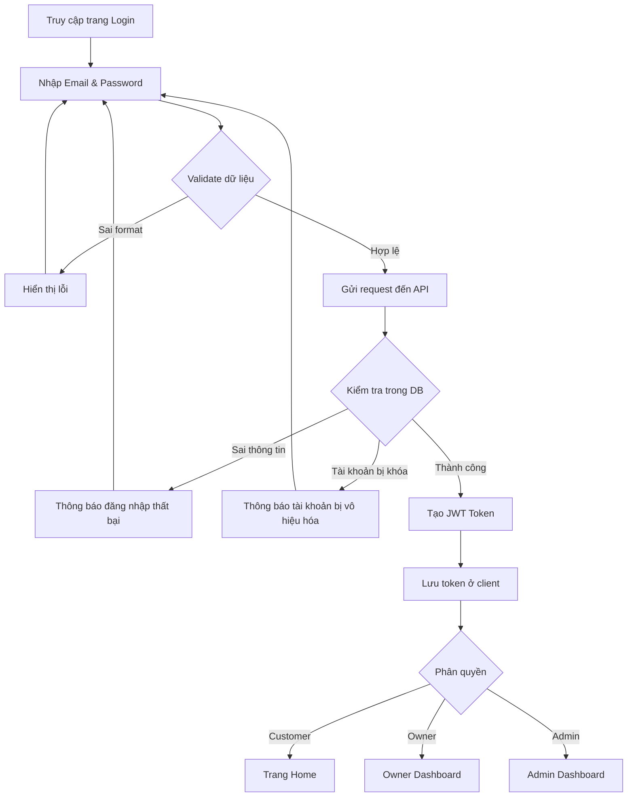
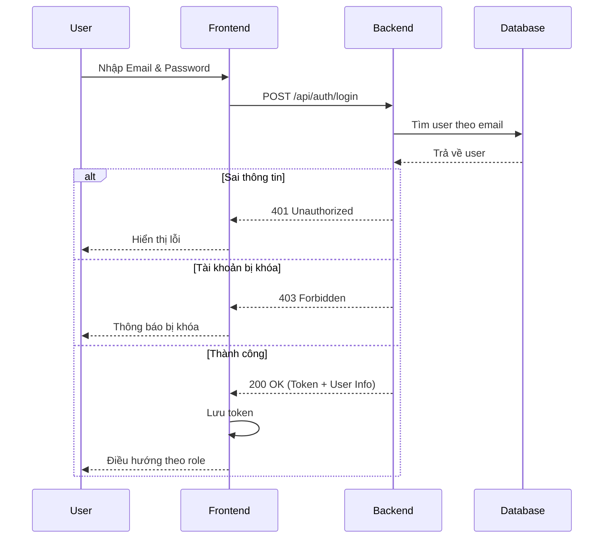

# Software Requirement Specification (SRS)
## Chức năng: Đăng nhập hệ thống (User Login)
**Mã chức năng:** AUTH-01  
**Trạng thái:** Draft / Review  
**Người soạn thảo:** [Nguyễn Văn Công]  
**Vai trò:** Developer / Analyst  

---

## 1. 📌 Mô tả tổng quan (Description)

Chức năng đăng nhập cho phép người dùng truy cập vào hệ thống thuê xe tự lái bằng tài khoản đã đăng ký.

Hệ thống hỗ trợ 3 vai trò người dùng:

- **Customer (Người thuê xe)**
- **Owner (Chủ xe)**
- **Admin (Quản trị viên)**

Sau khi đăng nhập thành công, hệ thống sẽ:

- Xác thực thông tin người dùng
- Cấp **Access Token (JWT)**
- Điều hướng người dùng đến giao diện phù hợp với vai trò

---

## 2. 🔄 Luồng nghiệp vụ (User Workflow)

| Bước | Hành động người dùng | Phản hồi hệ thống |
| :--- | :--- | :--- |
| 1 | Truy cập trang `/login` | Hiển thị form đăng nhập |
| 2 | Nhập Email & Password | Kiểm tra dữ liệu đầu vào |
| 3 | Nhấn "Đăng nhập" | Gửi request đến API |
| 4 | Backend xử lý | Kiểm tra thông tin trong database |
| 5 | Thông tin hợp lệ | Tạo JWT Token và trả về thông tin người dùng |
| 6 | Đăng nhập thành công | Frontend lưu token và điều hướng |
| 7 | Đăng nhập thất bại | Hiển thị thông báo lỗi |

---

## 🔄 Login Flow (Mermaid Diagram)

## 🔗 Sequence Diagram

## 3. 📊 Yêu cầu dữ liệu (Data Requirements)

### 3.1. Dữ liệu đầu vào (Input Fields)

- **Email:** `string`, bắt buộc, đúng định dạng email
- **Password:** `string`, bắt buộc, tối thiểu 8 ký tự

### 3.2. Dữ liệu xử lý

- Tìm user theo `Email` trong bảng `AppUsers`
- So sánh `Password` với `PasswordHash`
- Kiểm tra trạng thái tài khoản `IsActive`
- Xác định vai trò `Role`

### 3.3. Dữ liệu đầu ra

- `accessToken`
- `userId`
- `fullName`
- `email`
- `role`

### 3.4. Dữ liệu lưu trữ (Database - Bảng `AppUsers`)

- `Id`
- `FullName`
- `Email`
- `PasswordHash`
- `Role`
- `IsActive`
- `CreatedAt`

---

### 4. Ràng buộc kỹ thuật & Bảo mật (Technical Constraints)

- Giao tiếp client-server phải sử dụng **HTTPS**
- Mật khẩu phải được mã hóa (Bcrypt hoặc Argon2)
- Sử dụng **JWT Authentication**
- Token phải được gửi trong các request cần xác thực
- Không cho phép truy cập API nếu không có token hợp lệ
- Hệ thống phải kiểm tra `IsActive` trước khi đăng nhập
- Có thể giới hạn số lần đăng nhập sai (chống brute-force)

---

### 5. Trường hợp ngoại lệ & Xử lý lỗi (Edge Cases)

- **Email để trống**  
  → Hiển thị: "Vui lòng nhập email"

- **Password để trống**  
  → Hiển thị: "Vui lòng nhập mật khẩu"

- **Email sai định dạng**  
  → Hiển thị: "Email không đúng định dạng"

- **Email không tồn tại**  
  → Hiển thị: "Tài khoản không tồn tại"

- **Sai mật khẩu**  
  → Hiển thị: "Mật khẩu không chính xác"

- **Tài khoản bị khóa (IsActive = false)**  
  → Hiển thị: "Tài khoản đã bị vô hiệu hóa"

- **Token hết hạn**  
  → Yêu cầu đăng nhập lại

- **Lỗi server**  
  → Hiển thị: "Không thể kết nối đến máy chủ"

---

## 7. 🎨 Giao diện (UI/UX)

- Form đăng nhập gồm:
  - Email
  - Password
  - Nút "Đăng nhập"

- Password được ẩn ký tự khi nhập
- Hỗ trợ responsive (Desktop & Mobile)
- Nút đăng nhập có trạng thái loading khi gửi request
- Hiển thị lỗi rõ ràng khi đăng nhập thất bại

Sau khi đăng nhập thành công:

- **Customer → Trang Home**
- **Owner → Owner Dashboard / My Cars**
- **Admin → Admin Dashboard**

---

### 7. Điều kiện tiền đề (Pre-conditions)

- Người dùng đã có tài khoản  
- Hệ thống backend hoạt động  
- Database kết nối thành công  

---

### 8. Điều kiện hậu (Post-conditions)

- Người dùng được xác thực thành công  
- JWT Token được cấp phát  
- Frontend lưu trạng thái đăng nhập  
- Người dùng được điều hướng đúng theo vai trò  

---

