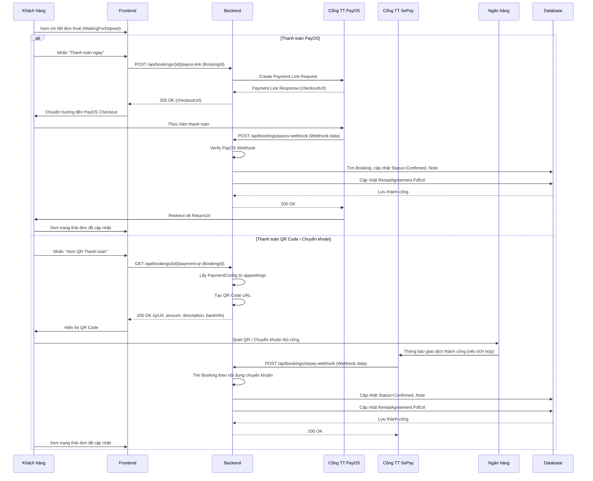

# Software Requirement Specification (SRS)

## Chức năng: Thanh toán đơn thuê xe

**Mã chức năng:** BOOK-03
**Trạng thái:** Draft / Review
**Người soạn thảo:** [Gemini Code Assist]
**Vai trò:** Developer / Analyst

---

### 1. Mô tả tổng quan (Description)

Chức năng này cho phép khách hàng thanh toán cho đơn thuê xe đã được chủ xe phê duyệt. Hệ thống hỗ trợ nhiều phương thức thanh toán:

- **Thanh toán trực tuyến qua cổng PayOS:** Khách hàng được chuyển hướng đến trang thanh toán của PayOS để hoàn tất giao dịch.
- **Thanh toán qua chuyển khoản ngân hàng (SePay Webhook):** Hệ thống tự động xác nhận thanh toán khi nhận được thông báo chuyển khoản từ SePay.
- **Thanh toán thủ công qua QR Code:** Khách hàng có thể quét mã QR để chuyển khoản ngân hàng.

Sau khi thanh toán thành công, trạng thái đơn thuê sẽ được cập nhật và hợp đồng thuê xe (PDF) sẽ được tạo/cập nhật.

---

### 2. Luồng nghiệp vụ (User Workflow)

#### 2.1. Luồng thanh toán qua PayOS (Trực tuyến)

| Bước | Hành động người dùng                                          | Phản hồi hệ thống                                                                                      |
| :--- | :------------------------------------------------------------ | :----------------------------------------------------------------------------------------------------- |
| 1    | Truy cập chi tiết đơn thuê đang ở trạng thái "Chờ thanh toán" | Hiển thị nút "Thanh toán ngay"                                                                         |
| 2    | Nhấn nút "Thanh toán ngay"                                    | Frontend gọi API `POST /api/bookings/{id}/payos-link`                                                  |
| 3    | Backend tạo link PayOS                                        | Backend gọi PayOS API, nhận `checkoutUrl`                                                              |
| 4    | Chuyển hướng đến PayOS                                        | Frontend điều hướng người dùng đến `checkoutUrl`                                                       |
| 5    | Thực hiện thanh toán trên PayOS                               | PayOS xử lý giao dịch                                                                                  |
| 6    | PayOS thông báo kết quả                                       | PayOS gửi webhook `POST /api/bookings/payos-webhook` về Backend                                        |
| 7    | Backend xử lý webhook                                         | Xác minh webhook, cập nhật trạng thái đơn thuê thành "Đã xác nhận", tạo/cập nhật PDF hợp đồng          |
| 8    | Hoàn tất                                                      | Khách hàng được thông báo thanh toán thành công (qua PayOS redirect hoặc cập nhật trạng thái trên app) |

#### 2.2. Luồng thanh toán qua chuyển khoản ngân hàng (SePay Webhook)

| Bước | Hành động người dùng                                       | Phản hồi hệ thống                                                                                                                          |
| :--- | :--------------------------------------------------------- | :----------------------------------------------------------------------------------------------------------------------------------------- |
| 1    | Thực hiện chuyển khoản ngân hàng với nội dung theo yêu cầu | Ngân hàng xử lý giao dịch                                                                                                                  |
| 2    | SePay nhận thông báo chuyển khoản                          | SePay gửi webhook `POST /api/bookings/sepay-webhook` về Backend                                                                            |
| 3    | Backend xử lý webhook                                      | Tìm đơn thuê dựa trên nội dung chuyển khoản, kiểm tra số tiền, cập nhật trạng thái đơn thuê thành "Đã xác nhận", tạo/cập nhật PDF hợp đồng |
| 4    | Hoàn tất                                                   | Khách hàng được thông báo thanh toán thành công (qua cập nhật trạng thái trên app)                                                         |

#### 2.3. Luồng thanh toán thủ công qua QR Code

| Bước | Hành động người dùng         | Phản hồi hệ thống                                                                                                    |
| :--- | :--------------------------- | :------------------------------------------------------------------------------------------------------------------- |
| 1    | Truy cập chi tiết đơn thuê   | Hiển thị nút "Xem QR thanh toán"                                                                                     |
| 2    | Nhấn nút "Xem QR thanh toán" | Frontend gọi API `GET /api/bookings/{id}/payment-qr`                                                                 |
| 3    | Backend tạo QR               | Backend lấy thông tin ngân hàng từ cấu hình, tạo URL QR code                                                         |
| 4    | Hiển thị QR                  | Frontend hiển thị mã QR và thông tin chuyển khoản                                                                    |
| 5    | Thực hiện chuyển khoản       | Khách hàng quét mã QR và chuyển khoản thủ công                                                                       |
| 6    | Chờ xác nhận                 | Khách hàng chờ hệ thống hoặc chủ xe xác nhận thanh toán (có thể qua SePay webhook hoặc xác nhận thủ công của chủ xe) |

---

## 🔄 Payment Flow (Mermaid Diagram)

```mermaid
flowchart TD
    subgraph Customer Interaction
        A[Xem chi tiết đơn thuê] --> B{Đơn ở trạng thái "Chờ thanh toán"?}
        B -- Có --> C[Chọn phương thức thanh toán]
        C -- PayOS --> D[Nhấn "Thanh toán PayOS"]
        C -- QR Code --> E[Nhấn "Xem QR Thanh toán"]
        C -- Chuyển khoản thủ công --> F[Thực hiện chuyển khoản ngân hàng]
    end

    subgraph PayOS Flow
        D --> G[Frontend: Gọi POST /api/bookings/{id}/payos-link]
        G --> H[Backend: Tạo PayOS Payment Link]
        H --> I[Frontend: Chuyển hướng đến PayOS Checkout]
        I --> J[Khách hàng thanh toán trên PayOS]
        J --> K[PayOS: Gửi Webhook POST /api/bookings/payos-webhook]
        K --> L[Backend: Xử lý PayOS Webhook]
    end

    subgraph QR Code Flow
        E --> M[Frontend: Gọi GET /api/bookings/{id}/payment-qr]
        M --> N[Backend: Tạo QR Code URL]
        N --> O[Frontend: Hiển thị QR Code & thông tin]
        O --> F
    end

    subgraph SePay Webhook Flow
        F --> P[SePay: Nhận thông báo chuyển khoản]
        P --> Q[SePay: Gửi Webhook POST /api/bookings/sepay-webhook]
        Q --> R[Backend: Xử lý SePay Webhook]
    end

    subgraph Backend Processing (Common)
        L --> S{Xác minh & Cập nhật Booking}
        R --> S
        S -- Thành công --> T[Cập nhật Status = Confirmed]
        T --> U[Tạo/Cập nhật RentalAgreement PDF]
        U --> V[Lưu thay đổi vào Database]
        V --> W[Thông báo thanh toán thành công]
        S -- Thất bại --> X[Ghi log lỗi / Không thay đổi trạng thái]
    end
```



---

### 3. Yêu cầu dữ liệu (Data Requirements)

#### 3.1. Dữ liệu đầu vào (Input)

- **`POST /api/bookings/{id}/payos-link`**:
  - `id`: `Guid`, ID của đơn thuê.
- **`POST /api/bookings/payos-webhook`**:
  - `webhookBody`: `Webhook` object từ PayOS (chứa `data`, `signature`, `checksum`).
- **`POST /api/bookings/sepay-webhook`**:
  - `data`: `SePayWebhookDto` object từ SePay (chứa `Content`, `TransferAmount`, v.v.).
- **`GET /api/bookings/{id}/payment-qr`**:
  - `id`: `Guid`, ID của đơn thuê.

#### 3.2. Dữ liệu xử lý (Logic Backend)

- **`CreatePayOSLink`**:
  - Xác thực `id` đơn thuê tồn tại và trạng thái là `WaitingForDeposit`.
  - Tạo `orderCode` duy nhất (dựa trên thời gian).
  - Gọi PayOS SDK `PaymentRequests.CreateAsync` với `Amount`, `Description`, `ReturnUrl`, `CancelUrl`.
  - Lưu `orderCode` vào `Note` của đơn thuê.
- **`PayOSWebhook`**:
  - Sử dụng PayOS SDK `Webhooks.VerifyAsync` để xác minh tính toàn vẹn của webhook.
  - Trích xuất thông tin từ `data` (Amount, Description, PaymentLinkId).
  - Tìm đơn thuê tương ứng dựa trên `Id` trong `Description`.
  - Kiểm tra trạng thái đơn thuê là `WaitingForDeposit` và chưa hết hạn thanh toán (dựa trên `OwnerAgreedAt` và cấu hình `AutoCancelTimeoutMinutes`).
  - Nếu `data.Amount` đủ lớn hơn hoặc bằng `TotalAmount` của đơn thuê:
    - Cập nhật `Status` của đơn thuê thành `BookingStatus.Confirmed`.
    - Thêm thông tin giao dịch vào `Note`.
    - Gọi `IContractPdfService.GenerateAsync` để tạo/cập nhật PDF hợp đồng.
- **`SePayWebhook`**:
  - Trích xuất `Content` và `TransferAmount` từ `SePayWebhookDto`.
  - Tìm đơn thuê có trạng thái `WaitingForDeposit` mà `Id` của nó (8 ký tự đầu) nằm trong `Content` của chuyển khoản.
  - Nếu `TransferAmount` đủ lớn hơn hoặc bằng `TotalAmount` của đơn thuê:
    - Cập nhật `Status` của đơn thuê thành `BookingStatus.Confirmed`.
    - Thêm thông tin giao dịch vào `Note`.
    - Gọi `IContractPdfService.GenerateAsync` để tạo/cập nhật PDF hợp đồng.
- **`GetPaymentQr`**:
  - Xác thực `id` đơn thuê tồn tại.
  - Lấy cấu hình ngân hàng từ `appsettings.json` (`PaymentConfig:BankId`, `AccountNo`, `AccountName`, `BankName`).
  - Tạo `description` cho nội dung chuyển khoản (chứa 8 ký tự đầu của Booking ID).
  - Tạo URL QR code theo định dạng VietQR.

#### 3.3. Dữ liệu đầu ra (Response)

- **`POST /api/bookings/{id}/payos-link`**:
  - `200 OK` với object chứa `checkoutUrl` (URL chuyển hướng đến PayOS).
- **`POST /api/bookings/payos-webhook`**:
  - `200 OK` với `{ success = true }` hoặc `{ success = false }` (theo yêu cầu của PayOS).
- **`POST /api/bookings/sepay-webhook`**:
  - `200 OK` với `{ success = true }` hoặc `{ message = "Không tìm thấy đơn hàng" }`.
- **`GET /api/bookings/{id}/payment-qr`**:
  - `200 OK` với object chứa `qrUrl`, `amount`, `description`, `bankName`, `accountNo`, `accountName`.

#### 3.4. Dữ liệu lưu trữ (Database)

- **Bảng `Bookings`**:
  - `Status`: Cập nhật thành `Confirmed`.
  - `Note`: Thêm thông tin giao dịch PayOS/SePay.
- **Bảng `RentalAgreements`**:
  - `PdfUrl`: Cập nhật đường dẫn đến file PDF hợp đồng mới (sau khi thanh toán).

---

### 4. Ràng buộc kỹ thuật & Bảo mật (Technical Constraints)

- **Xác thực API:** Các endpoint `CreatePayOSLink` và `GetPaymentQr` yêu cầu `Authorization: Bearer [JWT]` hợp lệ.
- **Webhook Security:**
  - `PayOSWebhook`: Yêu cầu xác minh chữ ký (signature) và checksum từ PayOS để đảm bảo tính toàn vẹn và nguồn gốc của dữ liệu.
  - `SePayWebhook`: Mặc dù không có cơ chế xác minh rõ ràng trong code hiện tại, cần đảm bảo endpoint này chỉ có thể được gọi bởi SePay hoặc có cơ chế bảo mật bổ sung (ví dụ: IP Whitelist, secret key).
- **Cấu hình nhạy cảm:** `PayOS:ClientId`, `ApiKey`, `ChecksumKey` và `PaymentConfig` phải được lưu trữ an toàn trong `appsettings.json` hoặc biến môi trường.
- **Tính toàn vẹn dữ liệu:** Sử dụng `await _db.SaveChangesAsync()` để đảm bảo các thay đổi vào database được lưu trữ một cách nguyên tử.
- **Idempotency:** Webhooks nên được thiết kế để xử lý các thông báo trùng lặp mà không gây ra lỗi hoặc thay đổi trạng thái không mong muốn.

---

### 5. Trường hợp ngoại lệ & Xử lý lỗi (Edge Cases)

- **Đơn thuê không tồn tại:** Trả về `404 NotFound`.
- **Đơn thuê không ở trạng thái chờ thanh toán:** Trả về `400 BadRequest`.
- **Đơn thuê đã hết hạn thanh toán:** Webhook trả về `200 OK` nhưng với thông báo lỗi nội bộ (ví dụ: "Đơn đã hết hạn thanh toán.") và không cập nhật trạng thái.
- **Lỗi kết nối PayOS:** `CreatePayOSLink` trả về `400 BadRequest` với thông báo lỗi từ PayOS.
- **Xác minh webhook thất bại:** Webhook trả về `200 OK` với `{ success = false }` hoặc ghi log lỗi mà không xử lý dữ liệu.
- **Số tiền thanh toán không đủ:** Webhook không cập nhật trạng thái đơn thuê.
- **Cấu hình PayOS/PaymentConfig thiếu:** Khởi tạo PayOS client hoặc tạo QR code thất bại, trả về lỗi server.
- **Lỗi tạo PDF:** Ghi log lỗi, nhưng vẫn cập nhật trạng thái đơn thuê nếu thanh toán thành công.

---

### 6. Giao diện (UI/UX)

- **Trang chi tiết đơn thuê:**
  - Hiển thị nút "Thanh toán ngay" (cho PayOS) và/hoặc "Xem QR thanh toán" khi đơn ở trạng thái `WaitingForDeposit`.
  - Hiển thị đồng hồ đếm ngược thời gian chờ thanh toán (nếu có).
  - Sau khi thanh toán thành công, trạng thái đơn thuê được cập nhật tự động hoặc sau khi refresh trang.
- **Trang hiển thị QR:** Hiển thị mã QR, số tiền, nội dung chuyển khoản, thông tin ngân hàng rõ ràng.
- **Thông báo:** Hiển thị thông báo thành công/thất bại sau khi thanh toán hoặc khi có lỗi.

---

### 7. Điều kiện tiền đề & Hậu điều kiện

- **Tiền đề (Pre-conditions):**
  - Người dùng đã đăng nhập.
  - Đơn thuê đã được tạo và đang ở trạng thái `WaitingForDeposit`.
  - Cấu hình PayOS và PaymentConfig đã được thiết lập chính xác.
- **Hậu điều kiện (Post-conditions):**
  - Nếu thanh toán thành công: Trạng thái đơn thuê được cập nhật thành `Confirmed`, hợp đồng PDF được tạo/cập nhật.
  - Nếu thanh toán thất bại/hủy: Trạng thái đơn thuê vẫn giữ nguyên hoặc được cập nhật thành `Cancelled`/`Rejected` (tùy logic hủy).
  - Thông tin giao dịch được ghi lại trong `Note` của đơn thuê.

```

```
