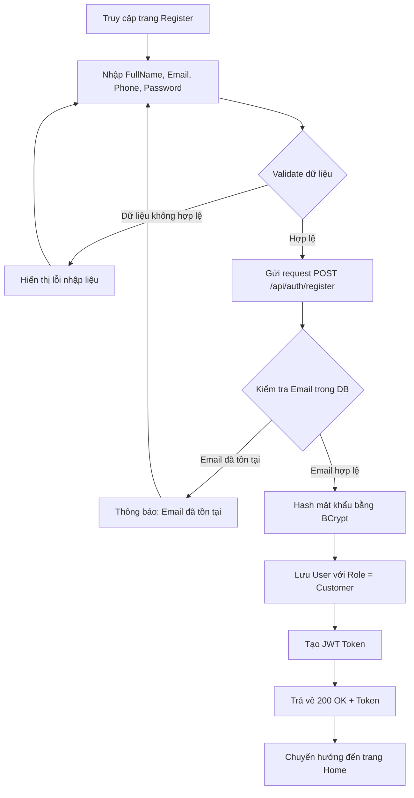
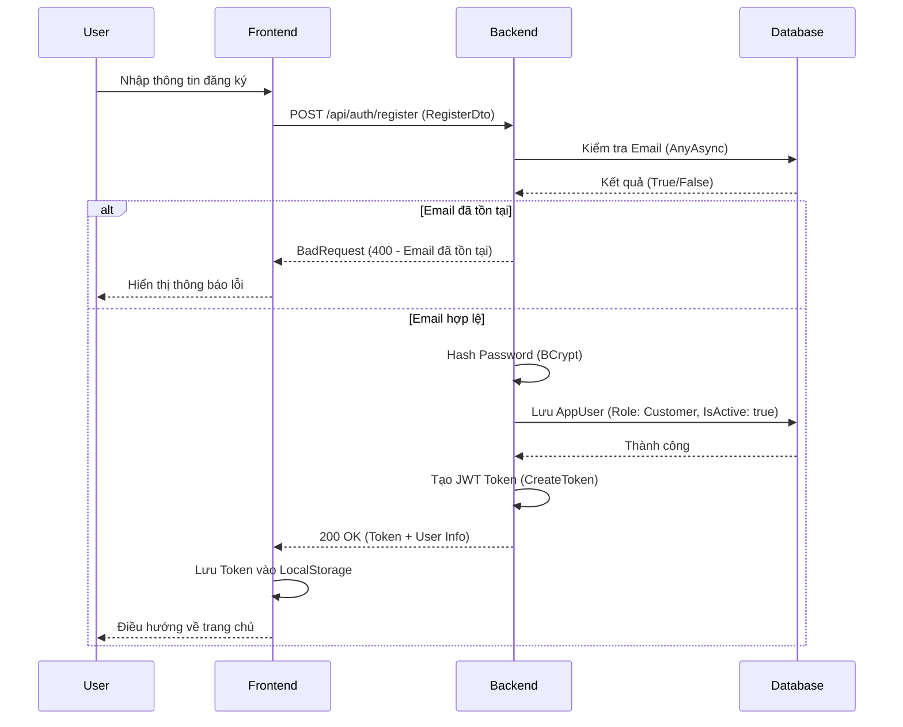

# Software Requirement Specification (SRS)
## Chức năng: Đăng ký tài khoản (User Registration)
**Mã chức năng:** AUTH-02  
**Trạng thái:** Draft / Review  
**Người soạn thảo:** [Vu Truong Giang]  
**Vai trò:** Developer / Analyst  

---

### 1. Mô tả tổng quan (Description)
Chức năng đăng ký cho phép người dùng mới tạo tài khoản để sử dụng hệ thống. Theo logic backend, mọi tài khoản đăng ký trực tiếp từ ứng dụng sẽ mặc định được gán vai trò là **Customer**. Sau khi đăng ký thành công, hệ thống tự động xác thực và cấp **JWT Token** để người dùng truy cập hệ thống ngay lập tức mà không cần đăng nhập lại.

---

### 2. Luồng nghiệp vụ (User Workflow)

| Bước | Hành động người dùng | Phản hồi hệ thống |
| :--- | :--- | :--- |
| 1 | Truy cập trang `/register` | Hiển thị form đăng ký (Họ tên, Email, SĐT, Mật khẩu) |
| 2 | Nhập thông tin và nhấn "Đăng ký" | Kiểm tra dữ liệu đầu vào (Format, bắt buộc) |
| 3 | Gửi request đến API đăng ký | Backend kiểm tra sự tồn tại của Email trong Database |
| 4 | Thông tin hợp lệ | Mã hóa mật khẩu, lưu User mới, tạo JWT Token |
| 5 | Đăng ký thành công | Trả về Token và điều hướng người dùng về trang Home |
| 6 | Đăng ký thất bại | Hiển thị thông báo lỗi cụ thể (ví dụ: Email đã tồn tại) |

---

## 🔄 Registration Flow (Mermaid Diagram)

---

### 3. Yêu cầu dữ liệu (Data Requirements)

#### 3.1. Dữ liệu đầu vào (Input Fields)
- **FullName:** `string`, bắt buộc, được `Trim()` khi lưu.
- **Email:** `string`, bắt buộc, đúng định dạng, tự động `ToLower()` để đồng nhất.
- **PhoneNumber:** `string`, không bắt buộc (optional), được `Trim()`.
- **Password:** `string`, bắt buộc, tối thiểu 6-8 ký tự.

#### 3.2. Dữ liệu xử lý
- **Check Exists:** Kiểm tra tính duy nhất của `Email` trong bảng `AppUsers`.
- **Security:** Mật khẩu được băm bằng thuật toán **BCrypt**.
- **Default Values:**
  - `Id`: Tự động tạo bằng `Guid.NewGuid()`.
  - `Role`: Mặc định là `Customer`.
  - `IsActive`: Mặc định là `true`.
  - `CreatedAt`: Lấy thời gian hiện tại `DateTime.UtcNow`.

#### 3.3. Dữ liệu đầu ra (Response)
- `token`: Chuỗi JWT dùng để xác thực các request sau.
- `user`: Đối tượng chứa `Id`, `FullName`, `Email`, `PhoneNumber`, `Role`.

#### 3.4. Dữ liệu lưu trữ (Database - Bảng `AppUsers`)
- `Id` (Primary Key)
- `FullName`
- `Email` (Unique Index)
- `PhoneNumber`
- `PasswordHash`
- `Role`
- `IsActive`
- `CreatedAt`

---

### 4. Ràng buộc kỹ thuật & Bảo mật (Technical Constraints)

- **Mã hóa:** Mật khẩu **không bao giờ** được lưu dưới dạng văn bản thuần (Plain-text).
- **HTTPS:** Toàn bộ quá trình đăng ký phải thực hiện qua giao thức bảo mật HTTPS.
- **Xác thực Role:** Role được gán cứng là `Customer` ở phía Backend để tránh việc người dùng can thiệp vào request để chiếm quyền Admin.
- **Performance:** Sử dụng **Async/Await** để tối ưu hóa hiệu suất xử lý đồng thời của server.
- **JWT:** Token trả về phải tuân thủ chuẩn JSON Web Token.

---

### 5. Trường hợp ngoại lệ & Xử lý lỗi (Edge Cases)

- **Email đã tồn tại:** Trả về lỗi 400 "Email đã tồn tại."
- **Định dạng Email sai:** Hiển thị thông báo "Email không đúng định dạng."
- **Mật khẩu quá ngắn:** Hiển thị thông báo "Mật khẩu tối thiểu 6-8 ký tự."
- **Dữ liệu trống:** Trả về lỗi cho các trường bắt buộc (`FullName`, `Email`, `Password`).
- **Lỗi Database:** Hiển thị "Không thể tạo tài khoản lúc này, vui lòng thử lại sau."

---

### 6. Giao diện (UI/UX)

- **Input Form:** Form nhập liệu rõ ràng, có nhãn (Label) và gợi ý (Placeholder).
- **Feedback:** Nút "Đăng ký" có hiệu ứng **Loading** khi đang chờ backend phản hồi.
- **Notification:** Hiển thị thông báo thành công dạng Toast hoặc Modal trước khi chuyển trang.
- **Responsive:** Giao diện hỗ trợ tốt trên các thiết bị di động và máy tính bảng.
- **Password Visibility:** Hỗ trợ nút ẩn/hiện mật khẩu khi người dùng nhập liệu.

---

### 7. Điều kiện tiền đề (Pre-conditions)

- Server Backend đang hoạt động bình thường.
- Database đã được kết nối và bảng `AppUsers` đã được khởi tạo.
- Hệ thống mạng của người dùng ổn định.

---

### 8. Điều kiện hậu (Post-conditions)

- Một bản ghi `AppUser` mới được lưu thành công vào Database.
- Người dùng nhận được JWT Token hợp lệ.
- Frontend lưu trạng thái đăng nhập và điều hướng người dùng về trang chủ (Home).
