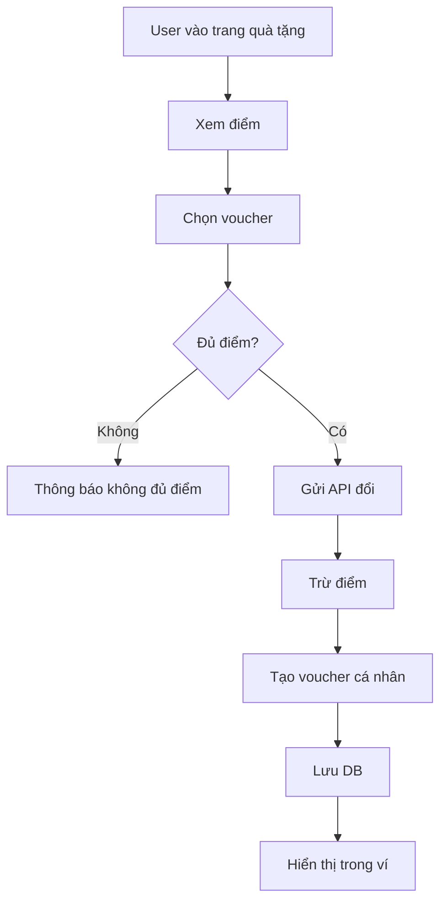
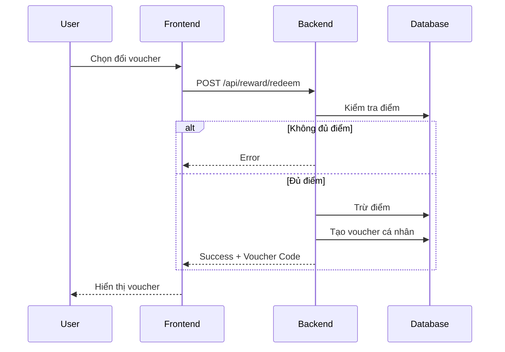

# Software Requirement Specification (SRS)

## Chức năng: Đổi điểm thưởng & Quà tặng (Reward Redeem)

**Mã chức năng:** REWARD-01  
**Trạng thái:** Draft / Review  
**Người soạn thảo:** Nguyễn Văn Công  
**Vai trò:** Developer / Analyst  

---

## 1. 📌 Mô tả tổng quan (Description)

Chức năng cho phép người dùng (Customer):

- Xem điểm thưởng hiện tại  
- Xem danh sách voucher có thể đổi  
- Đổi voucher bằng điểm  
- Nhận điểm thông qua mini game (Lucky Spin)  

Sau khi đổi thành công, hệ thống sẽ:

- Trừ điểm người dùng  
- Sinh mã voucher cá nhân  
- Lưu vào ví voucher của người dùng  

## 2. 🔄 Luồng nghiệp vụ (User Workflow)

| Bước | Hành động người dùng | Phản hồi hệ thống |
| :--- | :--- | :--- |
| 1 | Truy cập trang Quà tặng | Hiển thị điểm và danh sách voucher |
| 2 | Chọn voucher muốn đổi | Kiểm tra điểm |
| 3 | Nhấn "Đổi" | Gửi request |
| 4 | Backend xử lý | Trừ điểm |
| 5 | Tạo mã voucher | Lưu DB |
| 6 | Thành công | Hiển thị voucher trong ví |
| 7 | Chơi Lucky Spin | Nhận điểm |

## 🔄 Reward Flow (Mermaid Diagram)

## 🔗 Sequence Diagram

---

## 3. 📊 Yêu cầu dữ liệu (Data Requirements)

### Input

- userId (từ JWT)
- voucherId

---

### Output

- voucherCode
- rewardPoints (updated)

---

## 4. 🔌 API Specification

### Đổi voucher

POST /api/reward/redeem

Body:

{
  "voucherId": "string"
}

---

### Lấy điểm người dùng

GET /api/reward/points

---

### Lucky Spin

POST /api/reward/spin

## 5. ⚠️ Edge Cases

- Không đủ điểm → báo lỗi
- Voucher hết hạn → không cho đổi
- Lỗi server → thông báo lỗi
- Double click → không trừ điểm 2 lần

---

## 6. 📏 Business Rules

- Mỗi voucher có requiredPoints
- Điểm phải >= requiredPoints
- Trừ điểm trước khi cấp voucher
- Voucher cá nhân chỉ dùng cho user đó
- Lucky spin cộng điểm ngẫu nhiên