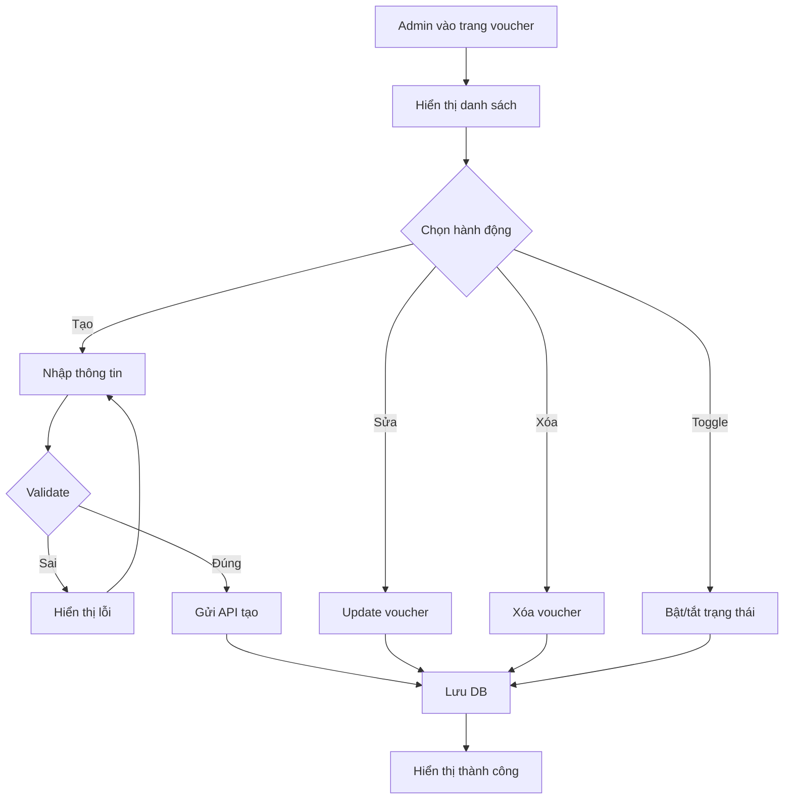
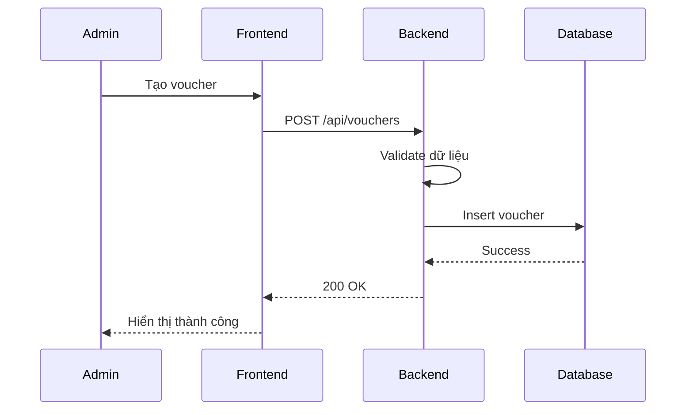

# Software Requirement Specification (SRS)

## Chức năng: Quản lý Voucher (Voucher Management)

**Mã chức năng:** VOUCHER-01  
**Trạng thái:** Draft / Review  
**Người soạn thảo:** Nguyễn Văn Công 
**Vai trò:** Developer / Analyst  

---

## 1. 📌 Mô tả tổng quan (Description)

Chức năng cho phép Admin quản lý voucher trong hệ thống.

Bao gồm:

- Tạo voucher mới  
- Cập nhật voucher  
- Xóa voucher  
- Bật / tắt trạng thái  

Hệ thống hỗ trợ 2 loại voucher:

- Voucher Public (dùng trực tiếp khi thuê xe)  
- Voucher Redeem (đổi bằng điểm thưởng)

---

## 2. 🔄 Luồng nghiệp vụ (User Workflow)

| Bước | Hành động Admin | Phản hồi hệ thống |
| :--- | :--- | :--- |
| 1 | Truy cập trang voucher | Hiển thị danh sách |
| 2 | Nhấn "Thêm voucher" | Hiển thị form |
| 3 | Nhập thông tin | Validate dữ liệu |
| 4 | Nhấn lưu | Gửi API |
| 5 | Thành công | Hiển thị voucher |
| 6 | Sửa voucher | Cập nhật |
| 7 | Xóa voucher | Xóa khỏi hệ thống |
| 8 | Bật / tắt trạng thái | Cập nhật trạng thái |

---

## 🔄 Voucher Flow (Mermaid Diagram)

## 🔗 Sequence Diagram

---

## 3. 📊 Yêu cầu dữ liệu (Data Requirements)

### Input

- name (string)
- discountType (money | percent)
- discountValue (number)
- minOrderValue (number)
- startDate (date)
- endDate (date)
- quantity (number)
- type (public | redeem)
- requiredPoints (number, optional)
- status (active | inactive)

---

### Output

- Danh sách voucher
- Trạng thái thành công / thất bại

---

## 4. 🔌 API Specification

### Tạo voucher

POST /api/vouchers

---

### Cập nhật voucher

PUT /api/vouchers/{id}

---

### Xóa voucher

DELETE /api/vouchers/{id}

---

### Lấy danh sách voucher

GET /api/vouchers

---

## 5. ⚠️ Edge Cases

- Thiếu thông tin → báo lỗi
- Ngày kết thúc < ngày bắt đầu → lỗi
- Giá trị giảm âm → lỗi
- Voucher hết hạn → không sử dụng

---

## 6. 📏 Business Rules

- Voucher phải có thời gian hợp lệ
- Voucher redeem phải có requiredPoints
- Không cho dùng voucher inactive
- Số lượng voucher không được âm